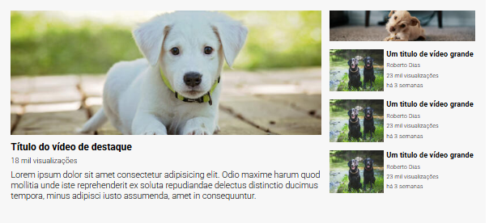

# Layout YouTube 
Este projeto tem por finalidade apresentar o um Layout de videos do Youtube contendo um video principal, e ao lado uma propaganda e uma coluna com os videos sugeridos com suas expecificações, como tempo desde a postagem, autor e nùmero de visualizações.

## Layout

## Tecnologias 
Nestre projeto, usamos o html para formar o esqueleto e o css para a estilização, esse projeto foi o primeiro em que aplicamos o Display Grid.
